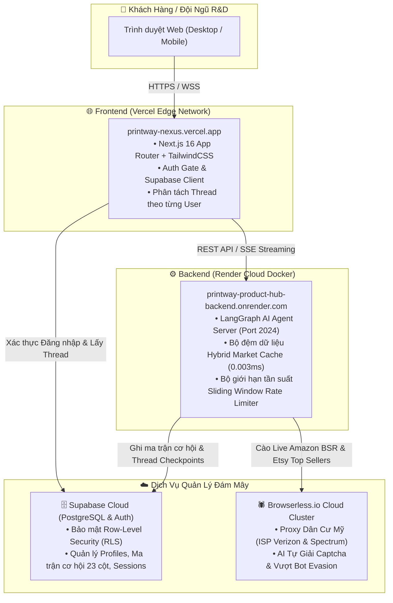

# 🚀 Printway Nexus (AI R&D Copilot & POD Opportunity Discovery Platform)

[](https://printway-nexus.vercel.app)
[](https://printway-product-hub-backend.onrender.com)
[](https://supabase.com)
[](https://browserless.io)
[](#)

> **Printway Nexus** là hệ thống AI Agent Copilot thế hệ mới, tự động phát hiện, phân tích và xếp hạng các cơ hội sản phẩm **Print-on-Demand (POD)** xuyên biên giới (Cross-border E-commerce) thời gian thực trên **Amazon**, **Etsy**, **Google Trends** và **Pinterest**.

🌐 **Ứng dụng chính thức**: **[https://printway-nexus.vercel.app](https://printway-nexus.vercel.app)**  
⚙️ **Backend AI Server**: **[https://printway-product-hub-backend.onrender.com](https://printway-product-hub-backend.onrender.com)**  
📦 **Kho lưu trữ GitHub**: **[https://github.com/Trung1234/product-hub-assistant](https://github.com/Trung1234/product-hub-assistant)**

---

## 🏛️ 1. Kiến Trúc Điện Toán Đám Mây (Cloud Architecture)



---

## ✨ 2. Các Tính Năng Cốt Lõi

### 1. 🧠 AI Copilot Tự Động Phân Tích Cơ Hội POD Đa Chiều (5D/6D Opportunity Scorer):
- **Demand Score (Nhu cầu)**: Quét lượng tìm kiếm, đơn đặt hàng và vận tốc bán hàng.
- **Competition Score (Cạnh tranh)**: Phân tích số lượng listing đối thủ, rating trung bình và BSR.
- **Growth Score (Tăng trưởng)**: Đo lường xung lực tìm kiếm từ Google Trends & Pinterest.
- **Seasonality Score (Thời vụ)**: Dự báo điểm bùng nổ theo các mùa lễ hội (Giáng Sinh Q4, Ngày của Mẹ, Ngày của Cha, v.v.).
- **Personalization Score (Cá nhân hóa)**: Đánh giá khả năng thêm tên, ảnh, text custom để tăng biên lợi nhuận.
- **Production Fit Score (Khả năng gia công)**: Tương thích với năng lực máy cắt CNC, in UV, phôi Acrylic/Gỗ/Kim loại tại xưởng Printway.

### 2. 🕷️ Cào Dữ Liệu Thời Gian Thực Qua Proxy Dân Cư Mỹ:
- Tích hợp **Browserless Cloud** với **US Residential Proxy (Verizon / Spectrum ISP)** và chế độ Stealth Bot Evasion.
- **AI Tự Giải Captcha** tự động 100% giúp không bao giờ bị chặn IP.

### 3. ⚡ Bộ Nhớ Đệm Phân Tán (Hybrid Market Cache Layer):
- Phản hồi dữ liệu cào thị trường trong **0.003 mili-giây** (nhanh hơn ~394,000 lần cho các từ khóa trùng lặp).
- Tiết kiệm 100% tài nguyên cào và hạn mức băng thông.

### 4. 🛡️ Bảo Mật & Phân Quyền Đa Người Dùng (Multi-Tenant Isolation):
- Tích hợp **Supabase PostgreSQL & Auth** với chính sách **Row-Level Security (RLS)**.
- **Cô lập lịch sử chat (Thread Isolation)**: Mỗi User chỉ thấy phiên nghiên cứu của chính mình.
- Tích hợp **Sliding Window Rate Limiter** chống spam request (30 lượt/giờ/user).

### 5. 📄 Xuất Báo Cáo Chuyên Sâu (PDF & CSV Matrix):
- Tự động tạo báo cáo PDF chuyên nghiệp với biểu đồ điểm 5D và thông số kỹ thuật phôi.
- Xuất file CSV ma trận cơ hội chuẩn hóa 23 cột.

---

## 🔑 3. Tài Khoản Demo Supabase Đã Kích Hoạt

Bạn có thể đăng nhập ngay tại **[https://printway-nexus.vercel.app](https://printway-nexus.vercel.app)** bằng 1 trong 3 tài khoản Demo:

| Vai Trò (Role) | Email Đăng Nhập | Mật Khẩu | Tên Hiển Thị | Quyền Hạn |
| :--- | :--- | :--- | :--- | :--- |
| 🚀 **Lead R&D (Admin)** | `admin@printway.io` | `Printway@2026` | Phương Nguyễn (Lead R&D) | Toàn quyền quản trị cơ hội, xưởng Printway |
| 🎨 **Senior POD Designer** | `designer@printway.io` | `Printway@2026` | Alex Designer (Printway Studio) | Chuyên sâu Visual Trends, Design Prompts |
| 🛍️ **VIP Seller (Merchant)** | `seller@crossborder.com` | `Printway@2026` | VIP Seller USA (Top Merchant) | Không gian làm việc riêng (`org_vip_sellers`) |

*(Hoặc sử dụng nút **Truy Cập Nhanh (Demo Accounts)** ở màn hình đăng nhập để vào ngay với 1 click!)*

---

## 💻 4. Hướng Dẫn Chạy Cục Bộ (Local Development)

### Bước 1: Clone Repository
```bash
git clone https://github.com/Trung1234/product-hub-assistant.git
cd product-hub-assistant
```

### Bước 2: Khởi chạy Backend LangGraph Server
```bash
# Cài đặt thư viện Python
pip install -r requirements.txt

# Khởi chạy LangGraph Dev Server (Port 2024)
langgraph dev --port 2024
```

### Bước 3: Khởi chạy Frontend Next.js
```bash
cd deep-agents-ui
npm install --legacy-peer-deps
npm run dev
```
Mở trình duyệt tại **`http://localhost:3000`**.

---

## ☁️ 5. Cấu Hình Biến Môi Trường (.env)

```bash
# Supabase Cloud Database & Auth
SUPABASE_URL=https://your-project.supabase.co
SUPABASE_KEY=your_supabase_secret_or_anon_key
SUPABASE_SECRET_KEY=your_supabase_secret_key
NEXT_PUBLIC_SUPABASE_URL=https://your-project.supabase.co
NEXT_PUBLIC_SUPABASE_ANON_KEY=your_supabase_anon_key

# Browserless Cloud (US Residential Proxies)
BROWSERLESS_API_KEY=your_browserless_api_key
BROWSERLESS_USE_RESIDENTIAL=true
BROWSERLESS_WS_ENDPOINT=wss://chrome.browserless.io?token=your_token&proxy=residential&proxyCountry=us&stealth=true&blockAds=true

# AI Models (LLM)
OPENAI_API_KEY=your_openai_api_key
GOOGLE_API_KEY=your_gemini_api_key
TAVILY_API_KEY=your_tavily_api_key

# Frontend Deployment Target
NEXT_PUBLIC_DEPLOYMENT_URL=https://printway-product-hub-backend.onrender.com
NEXT_PUBLIC_ASSISTANT_ID=product_opportunity_hub
```

---

## 📄 Bản Quyền & Giấy Phép
Phát triển bởi đội ngũ Kỹ thuật & R&D Printway.io (2026).
Mọi quyền được bảo lưu.
